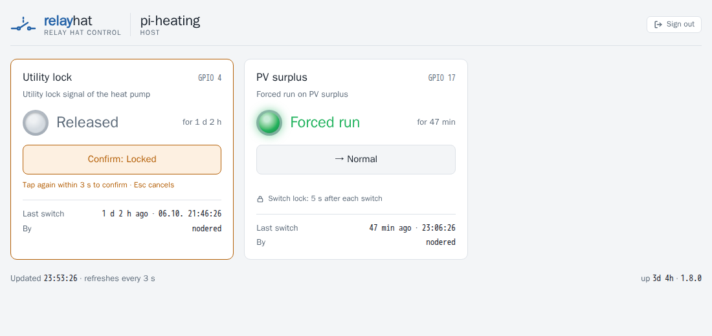
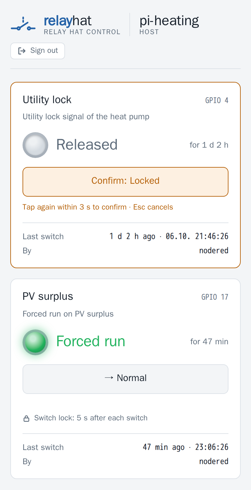

# relayhat

**Switch the relays of a Raspberry Pi relay HAT from your browser, Node-RED or Home Assistant.**

[](https://github.com/womat/relayhat/actions/workflows/ci.yml)
[](https://github.com/womat/relayhat/releases/latest)
[](LICENSE)
[](go.mod)


🇩🇪 [Deutsche Kurzfassung](README.de.md)

<p align="center">
  <picture>
    <source media="(prefers-color-scheme: dark)" srcset="docs/screenshots/web-ui-dark.png">
    
  </picture>
  &nbsp;
  
</p>

> **Got a Pi with a relay HAT?** The [Quick start](#quick-start) gets you from download to switching
> in the browser in about ten minutes.

A relay HAT turns a Raspberry Pi into a switch for things the Pi cannot drive itself: a heat pump's
utility lock or PV surplus input, a pump, a gate, a light. relayhat makes those relays usable from
everywhere on your network:

- a **REST API** over HTTPS with an API key, for Node-RED, Home Assistant, ioBroker, openHAB or a
  `curl` in a script,
- a **built-in web page** with a pilot light per relay and a **two-step switch** that a stray tap
  cannot trigger,
- relays that **keep their state** when the configuration is reloaded and come back in a state you
  choose (`off`, `on` or the **last** one) after a reboot or power cut,
- a **switch lock** per relay against rapid toggling, and a record of **who switched last**.

No cloud, no database, no runtime: a single binary, configured with one YAML file.

## Features

- **Web page** per device: pilot light in the relay's colour, your own words for on and off
  ("Locked" / "Released"), time in the current state, last switch with the client's host name —
  readable on a phone, light and dark mode
- **Two-step switching** in the browser: the first tap arms the button for 3 seconds, the second
  switches; a double tap, `Esc` or the timeout cancel
- **Start state** per relay: `off`, `on` or `last`, restored from a state file that is written
  atomically, so a power cut cannot corrupt it
- **Switch lock** (`minSwitchInterval`): a relay refuses to switch again within, say, 5 seconds or
  10 minutes of the last switch — for every client, answered with HTTP 429
- **Audit trail**: every switch is logged with relay, old and new state and client; the last one is
  shown on the page and kept across restarts
- **HTTPS REST API** with API key, IP allowlist / blocklist, JSON errors
- **Hot reload** via `SIGHUP`: a broken file is refused, the relays do not even flicker
- Release builds for every Raspberry Pi architecture, from the **Pi Zero (ARMv6)** to 64-bit systems

---

## Quick start

**1. Download** the archive for your Pi from the [latest release](https://github.com/womat/relayhat/releases/latest):

| Archive        | Raspberry Pi model                                    |
|----------------|-------------------------------------------------------|
| `linux_armv6`  | Pi 1 and Zero (1st gen); also runs on every newer Pi |
| `linux_armv7`  | Pi 2 / 3 / 4 / 5 / Zero 2 W with a 32-bit OS          |
| `linux_arm64`  | Pi 3 / 4 / 5 / 400 / Zero 2 W with a 64-bit OS        |

```sh
VERSION=1.9.0 ARCH=armv6        # see the release page for the latest version
BASE=https://github.com/womat/relayhat/releases/download/v$VERSION
curl -LO $BASE/relayhat_${VERSION}_linux_$ARCH.tar.gz -LO $BASE/checksums.txt
sha256sum -c checksums.txt --ignore-missing
tar xzf relayhat_${VERSION}_linux_$ARCH.tar.gz
```

**2. Install** binary, example configuration and a certificate:

```sh
sudo groupadd -r -f relayhat
sudo useradd -r -s /usr/sbin/nologin -g relayhat relayhat
sudo usermod -aG gpio relayhat
sudo mkdir -p /opt/relayhat/{bin,etc,data}

sudo install -m 755 relayhat /opt/relayhat/bin/
sudo install -m 640 config/config.yaml /opt/relayhat/etc/
sudo openssl req -x509 -nodes -newkey rsa:2048 -days 825 \
  -keyout /opt/relayhat/etc/key.pem -out /opt/relayhat/etc/cert.pem -subj "/CN=$(hostname)"
sudo chown -R relayhat:relayhat /opt/relayhat
```

**3. Configure** `/opt/relayhat/etc/config.yaml`: set `env: prod`, a random `apiKey`
(`openssl rand -hex 24`) and one entry per relay — see [Configuration](#configuration) and
[Hardware](#hardware).

**4. Start** it as a service and open the firewall:

```sh
sudo tee /etc/systemd/system/relayhat.service > /dev/null <<'EOF'
[Unit]
Description=relayhat - switch the relays of a Raspberry Pi relay HAT
After=network-online.target
Wants=network-online.target

[Service]
User=relayhat
Group=relayhat
Type=simple
ExecStart=/opt/relayhat/bin/relayhat
ExecReload=/bin/kill -HUP $MAINPID
Restart=on-failure
RestartSec=5

[Install]
WantedBy=multi-user.target
EOF

sudo systemctl daemon-reload
sudo systemctl enable --now relayhat
sudo ufw allow 8443/tcp          # if ufw is active
journalctl -u relayhat -n 20     # "Module started successfully"
```

**5. Open** `https://<your-pi>:8443/`, accept the self-signed certificate and enter the API key.

---

## Hardware

relayhat was written for the relay HATs of [BC Robotics](https://bc-robotics.com/) and runs on
every Raspberry Pi with a 40-pin header. It drives one GPIO output per relay: **high switches the
relay on**.

| Board | Relays | GPIO (BCM) | Header pins |
|---|---|---|---|
| [Raspberry Pi Zero Relay HAT](https://bc-robotics.com/shop/raspberry-pi-zero-relay-hat/) | 2 | 4, 17 | 7, 11 |
| [Raspberry Pi 4 Channel Relay HAT](https://bc-robotics.com/shop/raspberry-pi-4-channel-relay-hat/) | 4 | 4, 17, 27, 22 | 7, 11, 13, 15 |

Each relay brings its common (COM), normally open (NO) and normally closed (NC) contact out to a
screw terminal. Wire your load to **COM and NO** if it should run while the relay is on, to
**COM and NC** if it should run while it is off — which is also what happens while relayhat is
stopped or the Pi is without power.

Any other relay board with logic-level, **active-high** inputs works the same way: give each relay
its GPIO in the configuration. Boards whose relays switch on when the input is pulled low would
work inverted and are not supported.

> [!WARNING]
> The relays can switch mains voltage. Wiring 230 V / 120 V is a job for a qualified electrician;
> keep it in a closed enclosure, away from the Pi's low-voltage side. If in doubt, switch a
> contactor or an input of the device (such as a heat pump's control input) instead of the load
> itself.

BC Robotics also has a [getting-started tutorial](https://bc-robotics.com/tutorials/getting-started-raspberry-pi-relay-hat/)
for soldering the header and the terminal connections.

---

## Web UI

Open `https://<pi>:<listenPort>/` in a browser. The page asks for the API key once, keeps it in the
browser's local storage and sends it as `X-API-Key`; **Sign out** forgets it.

- One card per relay with its `label`, `description` and GPIO, a pilot light in the relay's `color`,
  the state (`onText` / `offText`) and how long it has been in it, and the last switch with the
  client's host name.
- **Two-step switching**: the first tap arms the button (`Confirm: …`, a bar runs down for 3 seconds),
  only a second tap within that time switches. A fast double tap, `Esc` or the timeout cancel. When
  another client switches the relay meanwhile, the pending confirmation is dropped.
- **Switch lock**: a relay with `minSwitchInterval` shows it below its button; after every switch,
  from the page or any other client, the button is disabled and counts down (`🔒 Locked · 0:04`).
  The lock applies to the page too, there is no override.
- Refreshes every 3 seconds while the tab is visible; if the Pi does not answer, a banner says so
  and the values are greyed out.
- Self-contained: no external fonts or scripts, so it works on a network without internet access.

The page itself is public, as it holds no data; everything it shows and switches goes through the
API key. Limit who can reach it with `allowedIPs`, e.g. to your home network.

---

## Node-RED and Home Assistant

Switching is a `PATCH` to `/relays/{name}/on` or `/off` with the API key in the `X-API-Key`
header; the answer is the relay's new state.

**Node-RED**: an *http request* node with method `PATCH`, URL
`https://<your-pi>:8443/relays/relay1/{{payload}}` (send `on` or `off` as `msg.payload`), the header
`X-API-Key` and a TLS configuration without *Verify server certificate* for the self-signed
certificate.

**Home Assistant**: a `rest_command` per state, used in automations or scripts:

```yaml
rest_command:
  relay1_on:
    url: https://<your-pi>:8443/relays/relay1/on
    method: patch
    headers:
      X-API-Key: !secret relayhat_api_key
    verify_ssl: false
  relay1_off:
    url: https://<your-pi>:8443/relays/relay1/off
    method: patch
    headers:
      X-API-Key: !secret relayhat_api_key
    verify_ssl: false
```

Repeating the current state is harmless: it is answered with 200, does not count as a switch and is
allowed during the switch lock — a flow may send its state on every run.

---

## REST API

| Method | Path                     | Auth    | Description              |
|--------|--------------------------|---------|--------------------------|
| GET    | `/`                      | –       | Web page                 |
| GET    | `/version`               | –       | App name and version     |
| GET    | `/health`                | API Key | Runtime health metrics   |
| GET    | `/relays`                | API Key | List all relays          |
| GET    | `/relays/{name}`         | API Key | Get relay state          |
| PATCH  | `/relays/{name}/{state}` | API Key | Set relay (`on` / `off`) |

Authentication via the `X-API-Key` header. Errors are returned as `{"error": "..."}` with the HTTP
status (401, 404, 400 for an invalid state, 429 with a `Retry-After` header while the relay's switch
lock runs); a 500 carries only `internal server error`, the cause is in the log. Every switch is
logged with relay, GPIO, old and new state and the client address.

A relay is returned as:

```json
{
  "name": "relay1",
  "state": "off",
  "description": "Utility lock signal of the heat pump",
  "gpio": 4,
  "display": { "label": "Heat pump", "color": "red", "onText": "Locked", "offText": "Released" },
  "lastChange": {
    "time": "2026-10-07T14:02:13+02:00",
    "ageSeconds": 2820.4,
    "source": "api",
    "client": "192.168.1.20",
    "host": "nodered.lan"
  },
  "lock": { "intervalSeconds": 5, "remainingSeconds": 0 }
}
```

`display` comes from the configuration and is meant for the web page. `lastChange` is the last
switch: `source` is `api`, or `start` when relayhat switched the relay to its start state; `host` is
the client's reverse DNS name, looked up after the switch and missing when there is none.
`lastChange` is kept in the `stateFile` and survives a restart. `lock` is present with
`minSwitchInterval` only; `remainingSeconds` is how long the relay still refuses to switch. A request
for the state the relay is already in succeeds without switching, so it neither changes `lastChange`
nor starts the lock.

```bash
# Get all relays
curl -k https://<your-pi>:8443/relays -H "X-API-Key: your-secret-key"

# Get a single relay
curl -k https://<your-pi>:8443/relays/relay1 -H "X-API-Key: your-secret-key"

# Turn a relay on / off
curl -k -X PATCH https://<your-pi>:8443/relays/relay1/on -H "X-API-Key: your-secret-key"
curl -k -X PATCH https://<your-pi>:8443/relays/relay1/off -H "X-API-Key: your-secret-key"
```

---

## Configuration

Default location: `/opt/relayhat/etc/config.yaml`

- `${VAR}` is replaced with the environment variable `VAR`, e.g. `apiKey: ${RELAYHAT_API_KEY}`. Only
  this form is expanded; a bare `$` stays as it is, so keys containing `$` are safe.
- Unknown keys are an error, so a typo cannot silently fall back to a default.
- The configuration is validated on start and before every reload: `env` is `dev` or `prod`, `apiKey`
  is set, every relay uses a GPIO between 2 and 27, and no GPIO is used twice.
- A weak `apiKey` (the example value or shorter than 16 characters) does not stop the service but is
  logged as a warning.
- `startState` per relay sets the state after the process starts: `off` (default), `on`, or `last` –
  the state before, read from `stateFile`. A missing, empty or damaged state file is not an error;
  the relays with `last` then start off and the log says why.
- `stateFile` also keeps the last switch of every relay, so the web page shows it after a restart.
  It is written on start and after every switch; `stateFile: ""` keeps nothing. The format of 1.7
  (`relay1: on`) is still read.
- `minSwitchInterval` per relay (e.g. `5s`, `10m`, at most `24h`) refuses a switch within that time
  of the last one with HTTP 429, for every client. It runs from the last switch, also across a reload
  or restart; start states are never refused.
- `label`, `color`, `onText` and `offText` only change how the web page shows a relay; `color` is
  `green`, `red` or `amber`. The relay name stays the API path, so renaming a relay on the page never
  breaks a client.

```yaml
# =============================================================================
# relayhat configuration
#
# ${VAR} is replaced with the environment variable VAR (only this form, a bare
# "$" stays as it is), e.g. apiKey: ${RELAYHAT_API_KEY}.
# Unknown keys are an error, so a typo cannot silently fall back to a default.
# =============================================================================

# logLevel defines the minimum log level.
# Messages with at least this level are logged.
# Allowed values: debug | info | warn | error
logLevel: info

# logDestination defines where logs are written to.
# Supported values: stdout | stderr | null | /path/to/logfile
logDestination: stdout

# environment: dev | prod
# dev falls back to the embedded self-signed certificate when certFile is
# missing; prod refuses to start without certFile.
env: dev

# stateFile keeps the state of every relay and its last switch (when, by which
# client), for startState: last and the "Last switch" in the web page. It is
# written after every switch and once on start; the directory must exist and be
# writable. Set it to "" to keep nothing (startState: last then needs a file).
stateFile: /opt/relayhat/data/state.yaml

# =============================================================================
# Webserver configuration (HTTPS)
# =============================================================================
webserver:
  # Host address the HTTPS server listens on (0.0.0.0 = all interfaces)
  listenHost: 0.0.0.0

  # Port the HTTPS server listens on
  listenPort: 8443

  # Global API key for protected endpoints, sent as X-API-Key header.
  # Use a random key of at least 16 characters; the example value is logged as a warning.
  apiKey: changeme!

  # TLS private key file
  keyFile: /opt/relayhat/etc/key.pem

  # TLS certificate file
  certFile: /opt/relayhat/etc/cert.pem

  # Blocked IP addresses or networks (empty = none blocked)
  # Examples: 192.168.0.1, 192.168.0.0/16, 10.0.0.0/8
  blockedIPs: []
  #  - 192.168.0.1
  #  - 192.168.0.0/16

  # Allowed IP addresses or networks (empty = all allowed)
  # Note: ::1 is the IPv6 loopback address
  # Examples: 127.0.0.1, ::1, 192.168.0.0/16
  allowedIPs: []
  #  - 127.0.0.1
  #  - ::1
  #  - 192.168.0.0/16

# =============================================================================
# relay configuration
#
# name: relay name used in the API (/relays/{name})
# gpio: BCM number 2..27, each gpio at most once
# startState: state after the process starts (boot, crash, systemctl restart):
#   off  (default) switched off
#   on   switched on
#   last the state before, from stateFile; off if it has none (first start,
#        missing or damaged file)
# A SIGHUP reload keeps the state of every relay whose gpio stays configured;
# startState applies only to relays that are added by the reload.
# A stop (SIGTERM/SIGINT) switches all relays off.
# minSwitchInterval: after a switch the relay refuses to be switched again for
#   this long, by any client including the web page (HTTP 429), e.g. 5s or 10m;
#   0 or missing disables it. The start counts as a switch, start states are
#   never refused, and a request for the state the relay is already in is no
#   switch.
#
# Web page only (optional, the API paths stay /relays/{name}):
#   label:   name on the card, default the relay name
#   color:   pilot light when on: green (default) | red | amber
#   onText:  word for the on state, default ON
#   offText: word for the off state, default OFF
#
# gpio 4 and 17: Pi Zero Relay HAT and 4-Channel Relay HAT;
# gpio 22 and 27: 4-Channel Relay HAT only.
# =============================================================================
relay:
  relay1:
    label: "Heat pump"
    description: "Utility lock signal of the heat pump"
    gpio: 4
    startState: off
    minSwitchInterval: 5s
    color: red
    onText: "Locked"
    offText: "Released"
  relay2:
    description: "gpio 17, Pi Zero Relay HAT and 4-Channel Relay HAT"
    gpio: 17
  relay3:
    description: "gpio 22, 4-Channel Relay HAT only"
    gpio: 22
  relay4:
    description: "gpio 27, 4-Channel Relay HAT only"
    gpio: 27
```

---

## Reload, restart and stop

Send `SIGHUP` to reload the configuration without restarting the process:

```sh
sudo systemctl reload relayhat
# or
kill -HUP $(pidof relayhat)
```

The config file is validated first; if it is broken, the reload is refused, logged, and the service
keeps running unchanged. Relays whose GPIO is still configured keep their state across the reload
(also when they are renamed) — the GPIO line is handed over, not reopened, so the relay does not
flicker. Removed relays are switched off, new ones start in their `startState`. The last switch of a
relay is kept as well.

| Event                                            | Relay state afterwards              |
|--------------------------------------------------|-------------------------------------|
| `SIGHUP` reload                                  | unchanged                           |
| process start (boot, crash, `systemctl restart`) | `startState`: `off`, `on` or `last` |
| stop (`SIGTERM`/`SIGINT`, `systemctl stop`)      | off                                 |

---

## Command-line Flags

| Flag        | Default                         | Description                                       |
|-------------|---------------------------------|---------------------------------------------------|
| `--config`  | `/opt/relayhat/etc/config.yaml` | Path to the configuration file                    |
| `--debug`   | `false`                         | Enable debug logging to stdout (overrides config) |
| `--version` | `false`                         | Print the application version and exit            |
| `--about`   | `false`                         | Print application details and exit                |
| `--help`    | `false`                         | Print this help message and exit                  |

The config file path can also be set via the environment variable `CONFIG_FILE`; `--config` wins
over it.

---

## TLS Certificate

relayhat serves HTTPS only. With `env: prod` it needs `certFile` and `keyFile`; the Quick start
creates a self-signed pair valid for 825 days, the maximum browsers accept. With `env: dev` it falls
back to a certificate embedded in the binary when `certFile` does not exist — convenient for a first
try, but that key ships in every release, so never use it on a reachable device.

---

## Backup & Restore

```sh
# Backup
sudo tar czf /tmp/relayhat-backup.tar.gz /opt/relayhat

# Restore
sudo tar xzf /tmp/relayhat-backup.tar.gz -C /
sudo chown -R relayhat:relayhat /opt/relayhat
sudo systemctl restart relayhat
```

---

## Releases

Every release on the [releases page](https://github.com/womat/relayhat/releases) carries archives for
all Raspberry Pi architectures with the binary, `config/config.yaml`, `README.md` and `LICENSE`,
plus a `checksums.txt` and a changelog with upgrade notes. Versions follow
[semantic versioning](https://semver.org/); a breaking change of the API or the configuration raises
the major version.

`relayhat --version` reports the release a binary was built from. A local build reports something
like `1.9.0-3-g0c13781-dirty` instead, which is how the two are told apart on a device.

Building from source needs Go and `make`: clone the repository and run `make help` for the targets;
[`CLAUDE.md`](CLAUDE.md) describes the architecture, the tests and the release process.

---

## License

relayhat is released under the MIT License - see [`LICENSE`](LICENSE) for the full text.

### Third-party licenses

The source tree contains no third-party code, but a **compiled binary statically links** the
modules below. Their terms apply to anyone distributing that binary, not to the sources here.

| Module                                            | License                |
|---------------------------------------------------|------------------------|
| `github.com/womat/golib`                          | MIT                    |
| `github.com/warthog618/go-gpiocdev`               | MIT                    |
| `github.com/golang-jwt/jwt/v5`                    | MIT                    |
| `gopkg.in/yaml.v3`                                | MIT and Apache-2.0     |
| `golang.org/x/sys`                                | BSD-3-Clause           |
| Swagger UI build only (`-tags swagger`):          |                        |
| `github.com/swaggo/swag`, `http-swagger`, `files` | MIT                    |
| `github.com/go-openapi/*`, `go.yaml.in/yaml/v3`   | Apache-2.0             |
| `github.com/KyleBanks/depth`                      | MIT                    |
| `golang.org/x/net`, `mod`, `sync`, `tools`        | BSD-3-Clause           |

All of these are permissive; none obliges relayhat to change its license.
